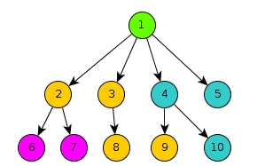

# Software evolution report series 2
- Simon Schneider
- Laurance Saess

# To-do

```
* Show % of duplicated lines
* Show number of clones
* Show number of clone classes
* Show biggest clone (in lines),
* Show biggest clone class
* Show example clones
* Add raw data table and explain why it was created
```

## Related files

* Manual: [manual.pdf](./manual.pdf)
* Result tables: [docs/results](./docs/results/)
* Result JSON exports: 


# Clone detection

We use an approach that uses the AST to detect code clones, as described by [Koschke, 2008]. 


## What code types do we detect

In order to detect software clones, we have to know what clones are and what type of clones exist. There multiple types of clones, some can be detected with a code analysis tool and others require code execution.  

We are using Rascal for the detection tool and only want to apply static code analysis. According to [Roy, Cordy, 2007], the clones types for static code analysis are:  

- Type 1 clones: The code fragments are identical, except for variations in white space and comments. 
- Type 2 clones: The code fragments are structurally and syntactically identical, except variations are allowed in identifiers, literals, types, layout and comments. 
- Type 3 clones: The code fragments are copied with further modifications. Statements can be altered in addition to variations in identifiers, literals, types, layout and comments. 

Our tool focuses on all these types of clones with an AST clone detection approach. So, what do these types of clones mean to us. An AST is a tree structure of the code, so we are going to compare nodes instead of code fragments. Source-code can be displayed in an AST structure as follows:   



Than we can define clones like this (where the symbol == means comparing nodes without looking at the sub-nodes):

- Type 1 clone:  ```node 6 == node 9```,  ```node 7 == node 10``` and ```node 2 == node 4```  then node 2 is a type 1 clone of node 4,  node 6 is a type 1 clone of node 9,  node 7 is a type 1 clone of node 10.  
- Type 2 clone: Node  ```node 9 == node 10``` where identifiers, literals, types, and layout are removed. Then node 9 is a type 2 clone of node 10.
- Type 3 clone: Node  ```node 2 == node 3``` and ```node 6 or node 7 == node 8``` where identifiers, literals, types, and layout are removed. Then node 2 is a type 3 clone of node 3. With type 3 clones you have to set a similarity threshold. It could be true that node 2 is a type 3 clone of node 3, but node 3 is not a type 3 clone of node 2. 

## The algorithm

The algorithm is the basic algorithm described by [Khatoon, Singh, Shukla, 2012]. The only difference is that we do not use an hash function ans that clone pairs are managed outside the detection code.

The hashes are used so that clones can be stored into buckets. We use relations instead so that we can use relation operations. There is a relation between node a and node b when they are registered as a clone. 

In pseudo code:

```
* x is the clone type
* y is the project location
* z is the min number of sub notes
* z' is the min number of lines of code per node
doCloneDetection(x,y,z,z')
  type = x
  a = (for type = 1:100 2:100 3:30)

  ast = loadAstForProject(y);
  ast <- normalize @ type 2 / type 3
  astList = getAllNodes(ast)
  astList <- remove when subitems less than z
  astList <- remove node when less than z' lines of code
  astList <- remove with invalid location

  @no duplicate compares
  @Do not compare when node is a subnode of that node 
  @similarity of nodeA and NodeB > a
  compare astList astList to nodeA nodeB:
      return add connection:<nodeA.l,nodeB.l>

  return set nodes:astList
  return
```

### Parameters

The real project has the following parameters:

- set[Declaration] ast
- bool normalizeAST
- int minimalNodeGroupSize
- int minimalCodeSize
- real minimalSimularity

What is a little bit different than the pseudo code. In the section we are going to describe what every parameter is and how it translates to the real project.

#### X is the clone type

You can define the clone type in the pseudo code. In the real project you have to translate it like this:

Type 1:

- normalizeAST = ```false```
- minimalSimularity = ```100```

Type 2:

- normalizeAST = ```true```
- minimalSimularity = ```100```

Type 3:

- normalizeAST = ```true```
- minimalSimularity = ```50``` <- or any other similarity factor you prefer.

For these settings, normalizeAST will remove all information that are type or name related. With this setting `int test` is the same as `float test2`.

For these setting, minimalSimularity will defined a percentage of how much of the node has to be the same to be considered equivalent.

#### Y is the project location

The pseudo code will genarate an AST based on the location of the project. The clone detection function requires the AST already what is done in the main.

- ast = ```createAstsFromEclipseProject(createM3FromEclipseProject(y), true);```

#### Z is the min number of sub notes and Z' are the minimum lines of code per node

You can display the AST as an tree. When you compare the nodes, there will be a lot of useless small clones. This parameter can be used to define a minimum size. Nodes are only considered that contain z sub nodes or has minimum z' lines of code.

- int minimalNodeGroupSize = z
- int minimalCodeSize = z'

 ## The node normalize function

The nodes are normalized for type 2 and type 3 clones. We replace all identifiers, literals, types and layout in the AST with a static value. 

 ```java
//Will remove all items that are inrelevant for type 2 and 3
public node normalizeNode(node nodeItem) {

	return visit(nodeItem) {
		case \enumConstant(_, args, cls) => \enumConstant("enumConstant", args, cls)
		case \enumConstant(_, args) => \enumConstant("enumConstant", args)
		case \class(_, ext, imp, bod) => \class("class", ext, imp, bod)
		case \interface(_, ext, imp, bod) => \interface("interface", ext, imp, bod)
		case \method(_, _, a, b, c) => \method(defaultType, "method", a, b, c)
		case \method(Type a,str b,list[Declaration] c,list[Expression] d) => \method(a,b,c,d)
		case \constructor(_, pars, expr, impl) => \constructor("constructor", pars, expr, impl)
		case \variable(_,ext) => \variable("variableName",ext)
		case \variable(_,ext, ini) => \variable("variable",ext,ini)
		case \typeParameter(_, list[Type] ext) => \typeParameter("typeParameter",ext)
		case \annotationType(_, bod) => \annotationType("annotationType", bod)
		case \annotationTypeMember(_, _) => \annotationTypeMember(defaultType, "annotationTypeMember")
		case \annotationTypeMember(_, _, def) => \annotationTypeMember(defaultType, "annotationTypeMember", def)
		case \parameter(_, _, ext) => \parameter(defaultType, "parameter", ext)
		case \vararg(_, _) => \vararg(defaultType, "vararg")
		case \characterLiteral(_) => \characterLiteral("a")
		case \fieldAccess(is, _) => \fieldAccess(is, "fa")
		case \methodCall(is, _, arg) => \methodCall(is, "methodCall", arg)
		case \methodCall(is, expr, _, arg) => \methodCall(is, expr, "methodCall", arg)
		case \number(_) => \number("1")
		case \booleanLiteral(_) => \booleanLiteral(true)
		case \stringLiteral(_) => \stringLiteral("str")
		case \type(_) => \type(defaultType)
		case \simpleName(_) => \simpleName("simpleName")
		case \markerAnnotation(_) => \markerAnnotation("markerAnnotation")
		case \normalAnnotation(_, memb) => \normalAnnotation("normalAnnotation", memb)
		case \memberValuePair(_, vl) => \memberValuePair("memberValuePair", vl)
		case \singleMemberAnnotation(_, vl) => \singleMemberAnnotation("singleMemberAnnotation", vl)
		case \break(_) => \break("break")
		case \continue(_) => \continue("continue")
		case \label(_, bdy) => \label("label", bdy)
		case Type _ => defaultType
		case Modifier _ => lang::java::jdt::m3::AST::\public()
	}
}

 ```


## The similarity function

We looked at multiple similarity function. One is described by [Baxter, Yahin, Moura, Sant'Anna, Bier, 1998].   Where:

```
Similarity = 2 x S / (2 x S + L + R)
		where:
		S = number of shared nodes
		L = number of different nodes in sub-tree 1
		R = number of different nodes in sub-tree 2
```

Lets assume that two nodes are going to be compared:

```
Node1.sub = [1..50]
Node2.sub = [41..90]
```

They share 10 nodes that are the same. Sub tree L and R have 40 nodes that are different.

This is going to result in:

```
2 * 10 / (2 * 10 + 40 + 40) = 0.20
```

 In another case:

```
Node1.sub = [1..50]
Node2.sub = [21..70]
```

They share 30 nodes that are the same. Sub tree L and R have 20 nodes that are different.

This is going to result in:

```
2 * 30 / (2 * 30 + 20 + 20) = 0.60
```

 In another case:

```
Node1.sub = [1..50]
Node2.sub = [11..60]
```

They share 40 nodes that are the same. Sub tree L and R have 10 nodes that are different.

This is going to result in:

```
2 * 40 / (2 * 40 + 10 + 10) = 0.80
```

What translates in rascal to this:

```java
public num nodeSimilarity(node nodeA, node nodeB) {
	list[node] nodeList1 = nodeToNodeList(nodeA); // 50 nodes
	list[node] nodeList2 = nodeToNodeList(nodeB); // 50 nodes

	list[node] sameItems = nodeList1 & nodeList2; // 40 nodes
	int sharedNodes = size(sameItems); //40

	num nodeADiff = size([nodei | nodei <- nodeList1, nodei notin sameItems]); //10
	num nodeBDiff = size([nodei | nodei <- nodeList2, nodei notin sameItems]); // 10
	
    //(2.0 * 40 / (2 * 40 + 10 + 10)) * 100.0
	num sim = (2.0 * sharedNodes / (2.0 * sharedNodes + nodeADiff + nodeBDiff)) * 100.0;
	
	return sim;
}
```


## Limitations of our AST approach

We cannot compare nodes, or groups of nodes that are on the same level to other nodes or group of nodes. For example, the tree below where nodes with a similar color are the same:


* The two large green trees are not seen as a type one or two clone, this because the sub nodes are different, what is correct.  
* The two yellow sub nodes of the first green tree are not seen as duplicates. This because our tool only compares whole nodes. 
* The two yellow sub nodes of the first green tree are also not compared with any combination of sequential nodes of the second green sub tree. This because our approach does not support comparing sequential nodes with other nodes in the system. It also does not support comparing these groups to groups under the same parent node.  

We did not add support for this because it adds a lot of complexity. The clone detection will also take a lot more times because of the high amount of additional checks that have to be preformed. Large clones are unlikely to be affected because in real-live projects, they normally are not on a single layer in the AST. For this project, and our goal is to find large clones; small codes have a smaller impact to the system. 

# Finding what lines are duplication

We use an custom algorithm for detecting the amount of duplicate lines.  The algorithm works like this:

1. Get all locations that contain an duplicate
2. Request from the M3 model, all the locations with comments
3. Go through every duplication, and get the lines for every location and look per line:
   1. If it is a one line comment
   2. If it is an empty line
   3. If the line is in a multi-line comment
4. When when of above is true, the line is counted as a non-duplicate
5. When above is false, the line is counted as a duplicate


We wrote the following unit test:

```java
import javax.annotation.Generated;

class dupTest {
	public void testM() {			//Comment
		int i1 = 1 + 1;				//Comment
		int i2 = 1 + 1 * 2;			//Comment
/*test*/int i3 = 1 + 1 / 4;/*test*/
}
	
	public void testM2() {			//Some test comment
/*test*/int i1 = 1 + 1;
/*
 * 
 * Test
 * 
 */
 /*est*/int i2 = 1 + 1 * 2;/*test*/
		/*
		 * test
		 */
		int i3 = 1 + 1 / 4;
	}
	
	public void testM3() {
		int i2 = 1 /*test*/+ 1 * 2;
		//test
		/*
		  
		  
		*/
		int i3 = 1 + 1 / 4;
		/*
		int i1 = 1 + 1;
		int i2 = 1 + 1 * 2;
		*/		
	}
	
}


```

The file has the following duplicate lines:

```
[4,5,6,7,8,10,11,17,21,22,25,31]
```

What is correct.


# Clone classes

The diagram below shows our approach to delete unnecessary clones, which are subsumed by other clones.

__Figure: Detecting clone classes__


At first, we flagged every clone that was included in another clone. For this, we can use the underlying location of a cloned node.

```Java
public bool containsLargerLocation(NodeIdLocation nlA, list[NodeIdLocation] nls){
	return any(NodeIdLocation nlB <- nls, nlA.id != nlB.id && nlB.l >= nlA.l);
}
```

This code above can tell us if a node (`nlA`) is located inside a clone of the node list (`nls`). In this first approach, we simply flagged and deleted the clones from the clone graph.

We soon recognized another type of clones (category 2), in which included clones are not deleted because they appear outside of other clones. In order to build the right clone classes, we use the following algorithm:

1. Flag every clone that is fully included in another clone.
2. Build a graph of clones
  1. Use the transitive closure for clone type 1 and 2. Type3 clones must not be transitive.
3. Remove a class of clones from the output if all nodes are flagged as deleted.
4. Output the clones as a graph that builds a cluster for every clone class (please see visualization below)

# Visualization

## Enclosure diagram

In his book, Adam Tornhill describes the methods and visualizations that criminologists use to find murderers and describes how software engineers can learn from this, by using similar methods to detect code smells or "dirty" developers. [Tornhill, 2015]

One example of visualizations that criminologists supposedly use maps in which they highlight hotspots in order to predict future crimes.

__Figure: Clone enclose diagram to show clone overview__


The visualization above tries to imitate this approach by creating a zoomable map of code clone criminals.

We used an enclosure diagram in order to handle large software systems. This diagram is based on a geometric layout algorithm called circle packing. Each circle represents a module or code class of the system.
The more duplicate lines a module has the larger the circle. We can immediately see the files with the largest clones and in which folders they are located.

## Clone graphs

The enclosure diagram is good to get a quick overview over the project, but it does not tell anything about how clones are connected inside the system.

__Figure: Graph of clone classes (approach 1)__


To show the maintainer how the clone classes in his project are structured we created the interactive diagram above.

In the first approach, we used the clones as nodes and their connections as edges. If there are two clones of type A in one file, they will be displayed as two connected nodes.
This view nicely shows that clone classes can be seen as clusters that are not interconnected. A behavior that we used to detect them (see the pseudo algorithm in "clone classes" section).

__Figure: Graph of clone files (approach 2)__


The second approach is more useful for a maintainer.  In this view, the files are represented as nodes and they are connected by an edge as soon as one duplicate is found in both files.
A highlighted area shows that these clusters are not fully interconnected, unlike in the first approach where the clones were fully transitive.
If `class A` and `class B` share a clone, and `class B` and `class C` share a clone, `class A` and `class C` are not connected (not transitive).

What a maintainer can learn from this view:

* There are many files that have clones in themselves - which should be an easy fix
* Most of the clusters are fully interconnected, which shows that there is some behavior that all of these files could have in common.
* Removing the largest 4 clone classes could reduce the number of files that contain clones drastically.


# Testing

We provided a test suit for  

# Maintainer requirements

1: Maintainers have to have an understanding of a program. There are multiple ways of getting an understanding at a global level of the program. In the paper [Storey, Fracchia, Müller, 1999] these are Macro-strategies. One strategy is called the "As-needed macro-strategies" strategy [Storey, Fracchia, Müller, 1999]. You only take a look at a part of the code when you needed it. With this approach, code clones give a very negative impact. When you want to make a change, you first have to find where the duplicates are, otherwise you can introduce bugs into the system. Our goal is to visualization of clone classes. We are going to resolve this by adding support for clicking so that you can see where else the same code is used.  

2: One issue in maintenance can be that duplicate in required to extent current functionality. When a maintainer wants to abstract these parts, he has to know on what locations these abstractions can be introduced. When you can find clones, and view how to clones look like, you can faster spot places where you can introduce abstraction. This is why we are making it possible to show the code per duplicate. Clicking in the clone will result in a overview of the code. 

3: When a maintainer wants to improve the code quality, it is useful to know in what part of the project the most duplicates are. This way, you know on what part of the project the most progress can be booked. It can be use as a guide for reducing complexity. To solve this, we added an overview of the largest code classes.   

#

# Literature

[Tornhill, 2015] Adam Tornhill. (2015). Your Code as a Crime Scene. https://doi.org/10.1017/CBO9781107415324.004

[Koschke, 2008] R. Koschke. (2008). Identifying and Removing Software Clones.

[Storey, Fracchia, Müller, 1999] Storey, M. A., Fracchia, F. D., & Müller, H. A. (1999). Cognitive design elements to support the construction of a mental model during software exploration. *Journal of Systems and Software*, *44*(3), 171-185.

[Baxter, Yahin, Moura, Sant'Anna, Bier, 1998] Baxter, I. D., Yahin, A., Moura, L., Sant'Anna, M., & Bier, L. (1998, November). Clone detection using abstract syntax trees. In *Software Maintenance, 1998. Proceedings., International Conference on* (pp. 368-377). IEEE.

[Khatoon, Singh, Shukla, 2012] Khatoon, T., Singh, P., & Shukla, S. (2012). Abstract Syntax Tree Based Clone Detection for Java Projects. *IOSR Journal of Engineering*, *2*(12).

[Roy, Cordy, 2007] Roy, C. K., & Cordy, J. R. (2007). A survey on software clone detection research. *Queen’s School of Computing TR*, *541*(115), 64-68.