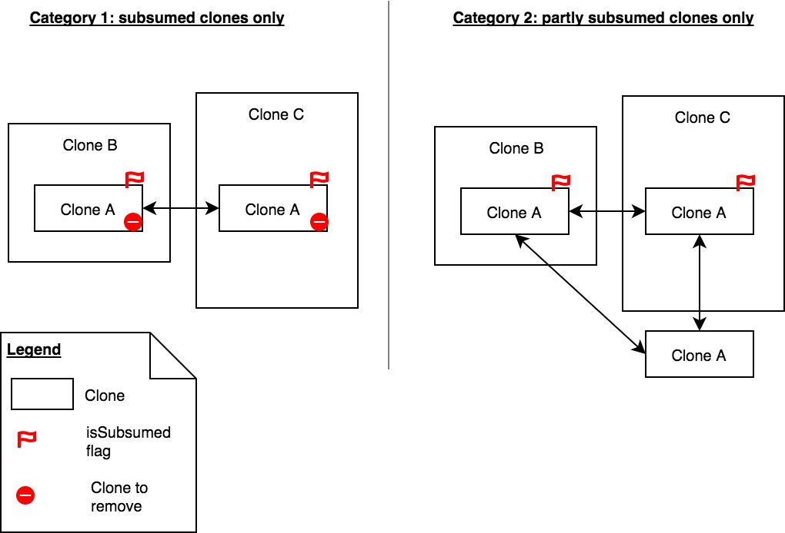

# Software evolution report series 2
- Simon Schneider
- Laurance Saess

# TO DO

```
* Show % of duplicated lines
* Show number of clones
* Show number of clone classes
* Show biggest clone (in lines),
* Show biggest clone class
* Show example clones
```

# Clone detection

We use a approach that uses the AST to detect code clones. We use the tactics that is described by [Koschke, 2008]. In pseudo code:
 
Where:
```
* x is the clone type
* y is the project location
* z is the min number of sub notes
* z' is the min number of lines of code per node
```

```
type = x
a = (for type = 1:100 2:100 3:30)

ast = loadAstForProject(y);
ast <- normalize @ type 2 / type 3
astList = getAllNodes(ast)
astList <- remove when subitems less than z
astList <- remove with invalid location

@no duplicate compares
@sub nodes for every node is minimal <z>
@sub nodes code size is minimal <z'>
@similarity of nodeA and NodeB > a
compare astList astList to nodeA nodeB:
	return add connection:<nodeA.l,nodeB.l>

return set nodes:astList
return

where:
	similarity nodea nodeb =
	nodea.subItems `similar` nodeb.subItems /
	(nodea.subcount + nodeb.subcount) * 100
```

## Parameters

The real project has the following parameters:
* set[Declaration] ast
* bool normalizeAST
* int minimalNodeGroupSize
* int minimalCodeSize
* real minimalSimularity

What is a little bit different than the pseudo code. In the section we are going to describe what every parameter is and how it translates to the real project.

### X is the clone type

You can define the clone type in the pseudo code. In the real project you have to translate it like this:

Type 1:
* normalizeAST = ```false```
* minimalSimularity = ```100```

Type 2:
* normalizeAST = ```true```
* minimalSimularity = ```100```

Type 3:
* normalizeAST = ```true```
* minimalSimularity = ```50``` <- or any other similarity factor you prefer.

For these settings, normalizeAST will remove all information that are type or name related. With this setting `int test` is the same as `float test2`.

For these setting, minimalSimularity will defined a percentage of how much of the node has to be the same to be considered equivalent.

### Y is the project location

The pseudo code will genarate an AST based on the location of the project. The clone detection function requires the AST already what is done in the main.

* ast = ```createAstsFromEclipseProject(createM3FromEclipseProject(y), true);```

### Z is the min number of sub notes and Z' are the minimum lines of code per node

You can display the AST as an tree. When you compare the nodes, there will be a lot of useless small clones. This parameter can be used to define a minimum size. Nodes are only considered that contain z sub nodes or has minimum z' lines of code.

* int minimalNodeGroupSize = z
* int minimalCodeSize = z'

# Clone classes

The diagram below shows our approach to delete unnecessary clones, which are subsumed by other clones.

__Figure: Detecting clone classes__



At first, we flagged every clone that was included in another clone. For this, we can use the underlying location of a cloned node.

```Java
public bool containsLargerLocation(NodeIdLocation nlA, list[NodeIdLocation] nls){
	return any(NodeIdLocation nlB <- nls, nlA.id != nlB.id && nlB.l >= nlA.l);
}
```

This code above can tell us if a node (`nlA`) is located inside a clone of the node list (`nls`). In this first approach, we simply flagged and deleted the clones from the clone graph.

We soon recognized another type of clones (category 2), in which included clones are not deleted because they appear outside of other clones. In order to build the right clone classes, we use the following algorithm:

1. Flag every clone that is fully included in another clone.
2. Build a graph of clones
	1. Use the transitive closure for clone type 1 and 2. Type3 clones must not be transitive.
3. Remove a class of clones from the output if all nodes are flagged as deleted.
4. Output the clones as a graph that builds a cluster for every clone class (please see visualization below)

# Visualization

## Enclosure diagram

In his book, Adam Tornhill describes the methods and visualizations that criminologists use to find murderers and describes how software engineers can learn from this, by using similar methods to detect code smells or "dirty" developers. [Tornhill, 2015]

One example of visualizations that criminologists supposedly use maps in which they highlight hotspots in order to predict future crimes.

__Figure: Clone enclose diagram to show clone overview__


The visualization above tries to imitate this approach by creating a zoomable map of code clone criminals.

We used an enclosure diagram in order to handle large software systems. This diagram is based on a geometric layout algorithm called circle packing. Each circle represents a module or code class of the system.
The more duplicate lines a module has the larger the circle. We can immediately see the files with the largest clones and in which folders they are located.

## Clone graphs

The enclosure diagram is good to get a quick overview over the project, but it does not tell anything about how clones are connected inside the system.

__Figure: Graph of clone classes (approach 1)__


To show the maintainer how the clone classes in his project are structured we created the interactive diagram above.

In the first approach, we used the clones as nodes and their connections as edges. If there are two clones of type A in one file, they will be displayed as two connected nodes.
This view nicely shows that clone classes can be seen as clusters that are not interconnected. A behavior that we used to detect them (see the pseudo algorithm in "clone classes" section).

__Figure: Graph of clone files (approach 2)__


The second approach is more useful for a maintainer.  In this view, the files are represented as nodes and they are connected by an edge as soon as one duplicate is found in both files.
A highlighted area shows that these clusters are not fully interconnected, unlike in the first approach where the clones were fully transitive.
If `class A` and `class B` share a clone, and `class B` and `class C` share a clone, `class A` and `class C` are not connected (not transitive).

What a maintainer can learn from this view:

* There are many files that have clones in themselves - which should be an easy fix
* Most of the clusters are fully interconnected, which shows that there is some behavior that all of these files could have in common.
* Removing the largest 4 clone classes could reduce the number of files that contain clones drastically.


##TODO: Add raw data table and explain why it was created

# Literature

[Tornhill, 2015] Adam Tornhill. (2015). Your Code as a Crime Scene. https://doi.org/10.1017/CBO9781107415324.004
[Koschke, 2008]. R. Koschke. (2008). Identifying and Removing Software Clones.
